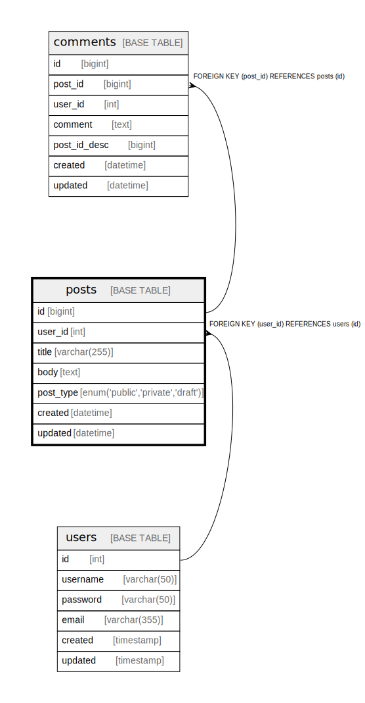

# posts

## Description

Posts table

<details>
<summary><strong>Table Definition</strong></summary>

```sql
CREATE TABLE `posts` (
  `id` bigint NOT NULL AUTO_INCREMENT,
  `user_id` int NOT NULL,
  `title` varchar(255) NOT NULL DEFAULT 'Untitled',
  `body` text NOT NULL,
  `post_type` enum('public','private','draft') NOT NULL COMMENT 'public/private/draft',
  `created` datetime NOT NULL,
  `updated` datetime DEFAULT NULL,
  PRIMARY KEY (`id`),
  UNIQUE KEY `user_id` (`user_id`,`title`),
  KEY `posts_user_id_idx` (`id`) USING BTREE,
  CONSTRAINT `posts_user_id_fk` FOREIGN KEY (`user_id`) REFERENCES `users` (`id`) ON DELETE CASCADE
) ENGINE=InnoDB DEFAULT CHARSET=utf8mb4 COLLATE=utf8mb4_0900_ai_ci COMMENT='Posts table'
```

</details>

## Labels

`green` `red` `blue`

## Columns

| # | Name | Type | Default | Nullable | Extra Definition | Children | Parents | Comment |
| - | ---- | ---- | ------- | -------- | ---------------- | -------- | ------- | ------- |
| 1 | id | bigint |  | false | auto_increment | [comments](comments.md) |  |  |
| 2 | user_id | int |  | false |  |  | [users](users.md) |  |
| 3 | title | varchar(255) | Untitled | false |  |  |  |  |
| 4 | body | text |  | false |  |  |  | post body |
| 5 | post_type | enum('public','private','draft') |  | false |  |  |  | public/private/draft |
| 6 | created | datetime |  | false |  |  |  |  |
| 7 | updated | datetime |  | true |  |  |  |  |

## Constraints

| # | Name | Type | Definition |
| - | ---- | ---- | ---------- |
| 1 | posts_user_id_fk | FOREIGN KEY | FOREIGN KEY (user_id) REFERENCES users (id) |
| 2 | PRIMARY | PRIMARY KEY | PRIMARY KEY (id) |
| 3 | user_id | UNIQUE | UNIQUE KEY user_id (user_id, title) |

## Indexes

| # | Name | Definition |
| - | ---- | ---------- |
| 1 | posts_user_id_idx | KEY posts_user_id_idx (id) USING BTREE |
| 2 | PRIMARY | PRIMARY KEY (id) USING BTREE |
| 3 | user_id | UNIQUE KEY user_id (user_id, title) USING BTREE |

## Triggers

| # | Name | Definition |
| - | ---- | ---------- |
| 1 | update_posts_updated | CREATE TRIGGER update_posts_updated BEFORE UPDATE ON posts<br>FOR EACH ROW<br>SET NEW.updated = CURRENT_TIMESTAMP() |

## Relations



---

> Generated by [tbls](https://github.com/k1LoW/tbls)
