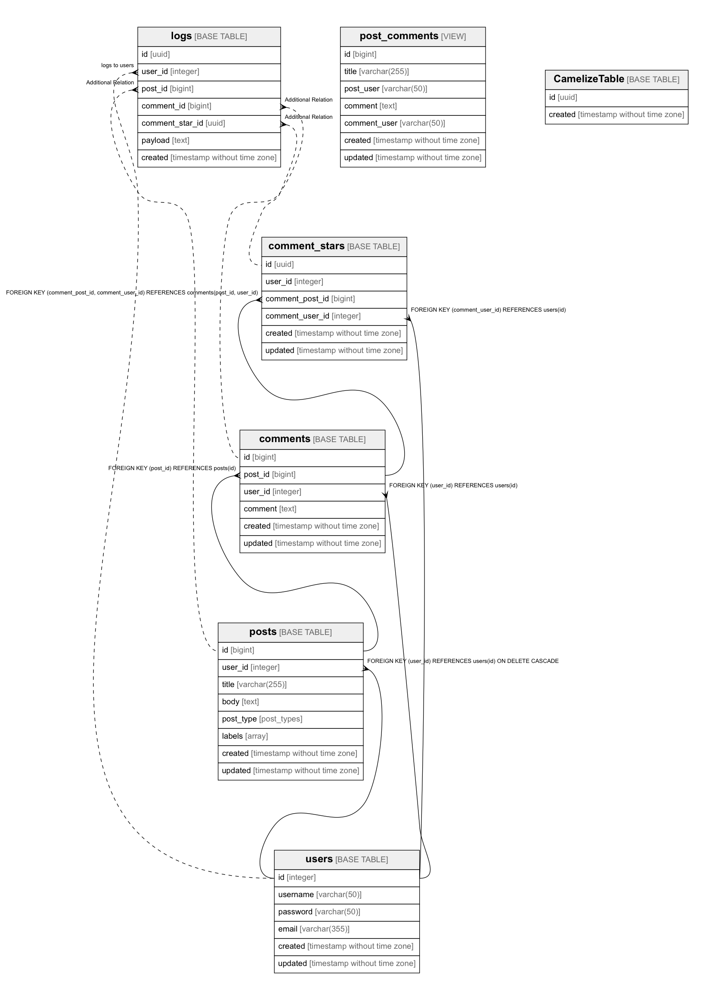

# testdb

## Tables

| Name | Columns | Comment | Type |
| ---- | ------- | ------- | ---- |
| [users](users.md) | 6 | Users table | BASE TABLE |
| [posts](posts.md) | 8 | Posts table | BASE TABLE |
| [comments](comments.md) | 6 |  | BASE TABLE |
| [comment_stars](comment_stars.md) | 6 |  | BASE TABLE |
| [logs](logs.md) | 7 | audit log table | BASE TABLE |
| [post_comments](post_comments.md) | 7 | post and comments View table | VIEW |
| [CamelizeTable](CamelizeTable.md) | 2 |  | BASE TABLE |

## Relations

---

> Generated by [tbls](https://github.com/k1LoW/tbls)