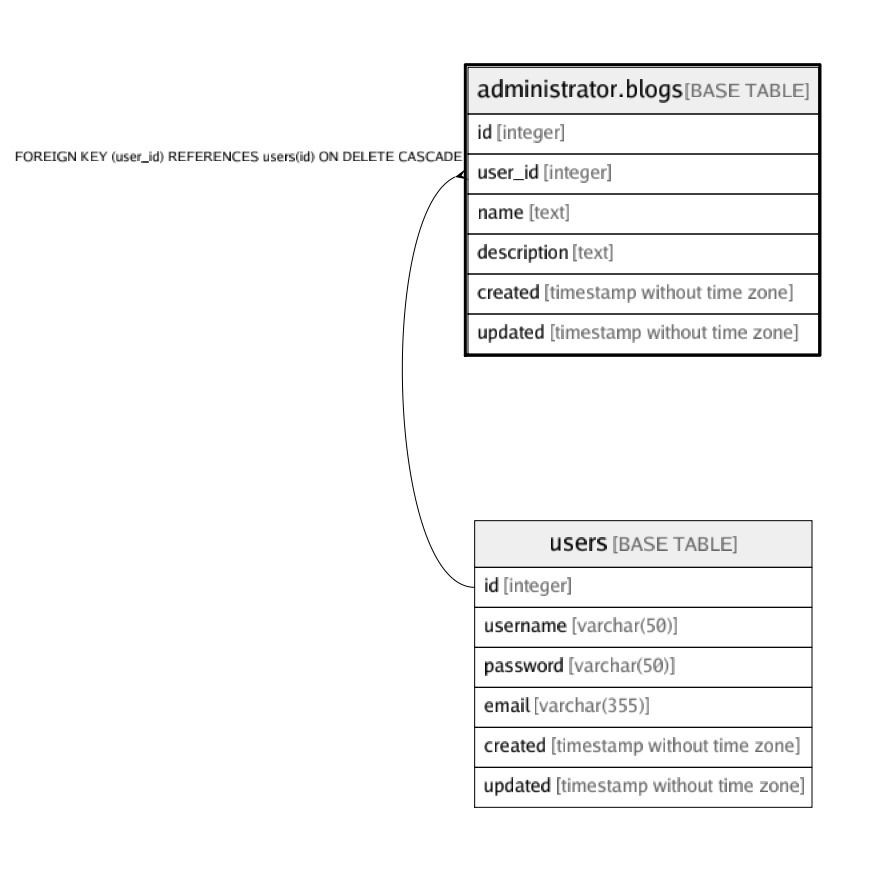

# administrator.blogs

## Description

## Columns

| Name | Type | Default | Nullable | Children | Parents | Comment |
| ---- | ---- | ------- | -------- | -------- | ------- | ------- |
| id | integer | nextval('administrator.blogs_id_seq'::regclass) | false |  |  |  |
| user_id | integer |  | false |  | [users](users.md) |  |
| name | text |  | false |  |  |  |
| description | text |  | true |  |  |  |
| created | timestamp without time zone |  | false |  |  |  |
| updated | timestamp without time zone |  | true |  |  |  |

## Constraints

| Name | Type | Definition |
| ---- | ---- | ---------- |
| blogs_user_id_fk | FOREIGN KEY | FOREIGN KEY (user_id) REFERENCES users(id) ON DELETE CASCADE |
| blogs_pkey | PRIMARY KEY | PRIMARY KEY (id) |

## Indexes

| Name | Definition |
| ---- | ---------- |
| blogs_pkey | CREATE UNIQUE INDEX blogs_pkey ON administrator.blogs USING btree (id) |

## Relations

---

> Generated by [tbls](https://github.com/k1LoW/tbls)