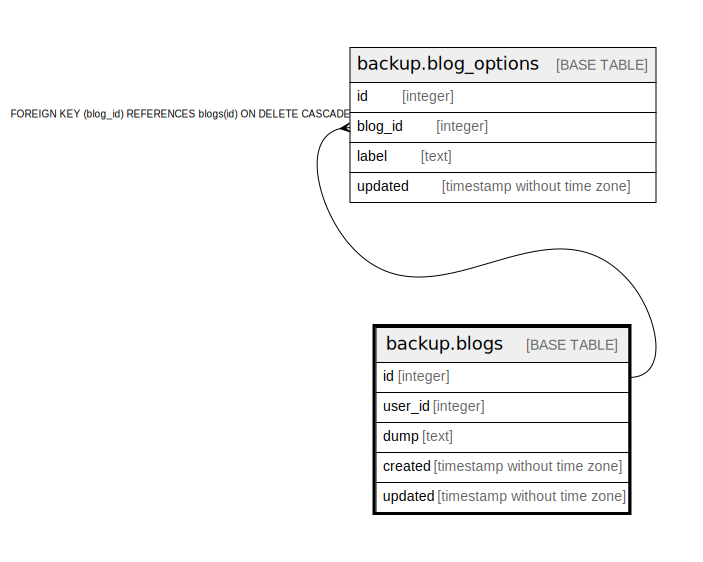

# backup.blogs

## Description

## Columns

| Name | Type | Default | Nullable | Children |
| ---- | ---- | ------- | -------- | -------- |
| id | integer | nextval('blogs_id_seq'::regclass) | false | [backup.blog_options](backup.blog_options.md) |
| user_id | integer |  | false |  |
| dump | text |  | false |  |
| created | timestamp without time zone |  | false |  |
| updated | timestamp without time zone |  | true |  |

## Constraints

| Name | Type | Definition |
| ---- | ---- | ---------- |
| blogs_pkey | PRIMARY KEY | PRIMARY KEY (id) |

## Indexes

| Name | Definition |
| ---- | ---------- |
| blogs_pkey | CREATE UNIQUE INDEX blogs_pkey ON backup.blogs USING btree (id) |

## Relations

---

> Generated by [tbls](https://github.com/k1LoW/tbls)
