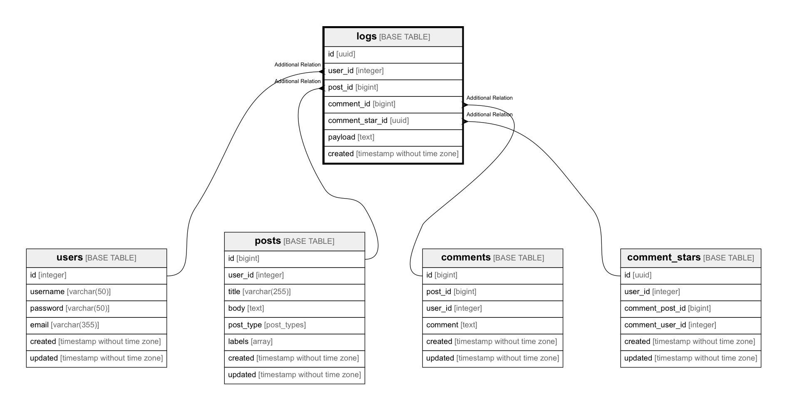

# logs

## Description

audit log table

## Columns

| Name | Type | Default | Nullable | Children | Parents | Comment |
| ---- | ---- | ------- | -------- | -------- | ------- | ------- |
| id | uuid | uuid_generate_v4() | false |  |  |  |
| user_id | integer |  | false |  | [users](users.md)  |  |
| post_id | bigint |  | true |  | [posts](posts.md)  |  |
| comment_id | bigint |  | true |  | [comments](comments.md)  |  |
| comment_star_id | uuid |  | true |  | [comment_stars](comment_stars.md)  |  |
| payload | text |  | true |  |  |  |
| created | timestamp without time zone |  | false |  |  |  |

## Constraints

| Name | Type | Definition |
| ---- | ---- | --- |

## Indexes

| Name | Definition |
| ---- | --- |

## Relations

---

> Generated by [tbls](https://github.com/k1LoW/tbls)