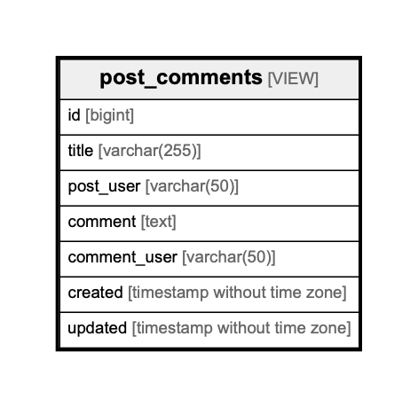

# post_comments

## Description

post and comments View table
<details>
<summary><strong>Table Definition</strong></summary>

```sql
CREATE VIEW post_comments AS (
 SELECT c.id,
    p.title,
    u2.username AS post_user,
    c.comment,
    u2.username AS comment_user,
    c.created,
    c.updated
   FROM (((posts p
     LEFT JOIN comments c ON ((p.id = c.post_id)))
     LEFT JOIN users u ON ((u.id = p.user_id)))
     LEFT JOIN users u2 ON ((u2.id = c.user_id)))
)
```

</details>


## Columns

| Name | Type | Default | Nullable | Children | Parents | Comment |
| ---- | ---- | ------- | -------- | -------- | ------- | ------- |
| id | bigint |  | true |  |  | comments.id |
| title | varchar(255) |  | true |  |  | posts.title |
| post_user | varchar(50) |  | true |  |  | posts.users.username |
| comment | text |  | true |  |  |  |
| comment_user | varchar(50) |  | true |  |  | comments.users.username |
| created | timestamp without time zone |  | true |  |  | comments.created |
| updated | timestamp without time zone |  | true |  |  | comments.updated |

## Constraints

| Name | Type | Definition |
| ---- | ---- | --- |

## Indexes

| Name | Definition |
| ---- | --- |

## Relations



---

> Generated by [tbls](https://github.com/k1LoW/tbls)