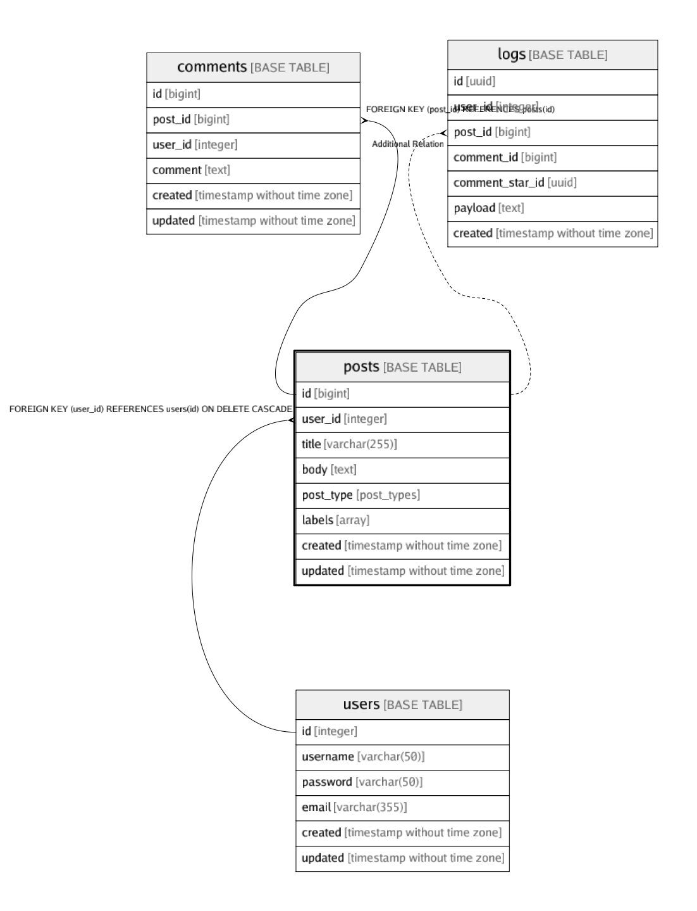

# posts

## Description

Posts table

## Columns

| Name | Type | Default | Nullable | Children | Parents | Comment |
| ---- | ---- | ------- | -------- | -------- | ------- | ------- |
| id | bigint | nextval('posts_id_seq'::regclass) | false | [comments](comments.md) [logs](logs.md)  |  |  |
| user_id | integer |  | false |  | [users](users.md)  |  |
| title | varchar(255) |  | false |  |  |  |
| body | text |  | false |  |  | post body |
| post_type | post_types |  | false |  |  | public/private/draft |
| labels | array |  | true |  |  |  |
| created | timestamp without time zone |  | false |  |  |  |
| updated | timestamp without time zone |  | true |  |  |  |

## Constraints

| Name | Type | Definition |
| ---- | ---- | --- |
| posts_id_pk | PRIMARY KEY | PRIMARY KEY (id) |
| posts_user_id_title_key | UNIQUE | UNIQUE (user_id, title) |
| posts_user_id_fk | FOREIGN KEY | FOREIGN KEY (user_id) REFERENCES users(id) ON DELETE CASCADE |

## Indexes

| Name | Definition |
| ---- | --- |
| posts_id_pk | CREATE UNIQUE INDEX posts_id_pk ON public.posts USING btree (id) |
| posts_user_id_title_key | CREATE UNIQUE INDEX posts_user_id_title_key ON public.posts USING btree (user_id, title) |
| posts_user_id_idx | CREATE INDEX posts_user_id_idx ON public.posts USING btree (user_id) |

## Relations

---

> Generated by [tbls](https://github.com/k1LoW/tbls)