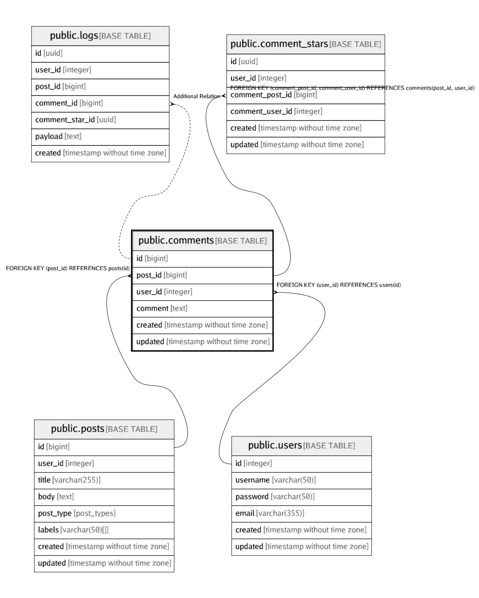

# public.comments

## Description

Comments  
Multi-line  
table  
comment

## Columns

| Name | Type | Default | Nullable | Children | Parents | Comment |
| ---- | ---- | ------- | -------- | -------- | ------- | ------- |
| id | bigint | nextval('comments_id_seq'::regclass) | false | [public.logs](public.logs.md) |  |  |
| post_id | bigint |  | false | [public.comment_stars](public.comment_stars.md) | [public.posts](public.posts.md) |  |
| user_id | integer |  | false | [public.comment_stars](public.comment_stars.md) | [public.users](public.users.md) |  |
| comment | text |  | false |  |  | Comment Multi-line column comment |
| created | timestamp without time zone |  | false |  |  |  |
| updated | timestamp without time zone |  | true |  |  |  |

## Constraints

| Name | Type | Definition |
| ---- | ---- | ---------- |
| comments_user_id_fk | FOREIGN KEY | FOREIGN KEY (user_id) REFERENCES users(id) |
| comments_post_id_fk | FOREIGN KEY | FOREIGN KEY (post_id) REFERENCES posts(id) |
| comments_id_pk | PRIMARY KEY | PRIMARY KEY (id) |
| comments_post_id_user_id_key | UNIQUE | UNIQUE (post_id, user_id) |

## Indexes

| Name | Definition |
| ---- | ---------- |
| comments_id_pk | CREATE UNIQUE INDEX comments_id_pk ON public.comments USING btree (id) |
| comments_post_id_user_id_key | CREATE UNIQUE INDEX comments_post_id_user_id_key ON public.comments USING btree (post_id, user_id) |
| comments_post_id_user_id_idx | CREATE INDEX comments_post_id_user_id_idx ON public.comments USING btree (post_id, user_id) |

## Relations

---

> Generated by [tbls](https://github.com/k1LoW/tbls)
