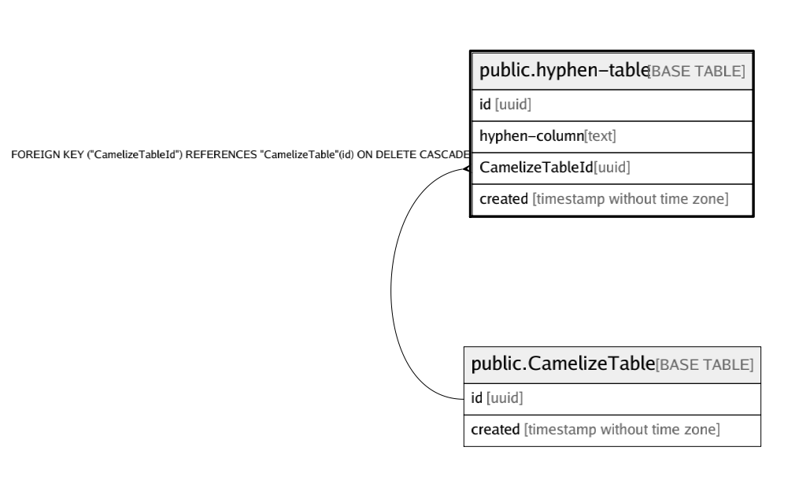

# public.hyphen-table

## Description

## Columns

| Name | Type | Default | Nullable | Children | Parents | Comment |
| ---- | ---- | ------- | -------- | -------- | ------- | ------- |
| id | uuid | uuid_generate_v4() | false |  |  |  |
| hyphen-column | text |  | false |  |  |  |
| CamelizeTableId | uuid |  | false |  | [public.CamelizeTable](public.CamelizeTable.md) |  |
| created | timestamp without time zone |  | false |  |  |  |

## Constraints

| Name | Type | Definition |
| ---- | ---- | ---------- |
| hyphen-table_CamelizeTableId_fk | FOREIGN KEY | FOREIGN KEY ("CamelizeTableId") REFERENCES "CamelizeTable"(id) ON DELETE CASCADE |
| hyphen-table_hyphen-column_key | UNIQUE | UNIQUE ("hyphen-column") |

## Indexes

| Name | Definition |
| ---- | ---------- |
| hyphen-table_hyphen-column_key | CREATE UNIQUE INDEX "hyphen-table_hyphen-column_key" ON public."hyphen-table" USING btree ("hyphen-column") |

## Relations

---

> Generated by [tbls](https://github.com/k1LoW/tbls)
