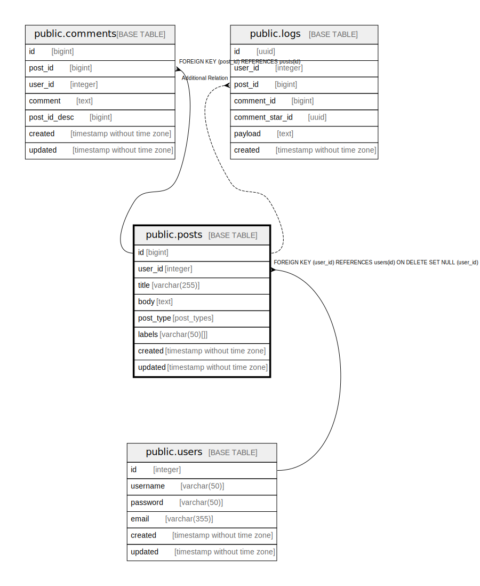

# public.posts

## Description

Posts table

## Columns

| Name | Type | Default | Nullable | Children | Parents | Comment |
| ---- | ---- | ------- | -------- | -------- | ------- | ------- |
| id | bigint | nextval('posts_id_seq'::regclass) | false | [public.comments](public.comments.md) [public.logs](public.logs.md) |  |  |
| user_id | integer |  | false |  | [public.users](public.users.md) |  |
| title | varchar(255) | 'Untitled'::character varying | false |  |  |  |
| body | text |  | false |  |  | post body |
| post_type | post_types |  | false |  |  | public/private/draft |
| labels | varchar(50)[] |  | true |  |  |  |
| created | timestamp without time zone |  | false |  |  |  |
| updated | timestamp without time zone |  | true |  |  |  |

## Constraints

| Name | Type | Definition | Comment |
| ---- | ---- | ---------- | ------- |
| update_posts_updated | TRIGGER | CREATE CONSTRAINT TRIGGER update_posts_updated AFTER INSERT OR UPDATE ON public.posts NOT DEFERRABLE INITIALLY IMMEDIATE FOR EACH ROW EXECUTE FUNCTION update_updated() |  |
| posts_user_id_fk | FOREIGN KEY | FOREIGN KEY (user_id) REFERENCES users(id) ON DELETE CASCADE | posts -> users |
| posts_id_pk | PRIMARY KEY | PRIMARY KEY (id) |  |
| posts_user_id_title_key | UNIQUE | UNIQUE (user_id, title) |  |

## Indexes

| Name | Definition | Comment |
| ---- | ---------- | ------- |
| posts_id_pk | CREATE UNIQUE INDEX posts_id_pk ON public.posts USING btree (id) |  |
| posts_user_id_title_key | CREATE UNIQUE INDEX posts_user_id_title_key ON public.posts USING btree (user_id, title) |  |
| posts_user_id_idx | CREATE INDEX posts_user_id_idx ON public.posts USING btree (user_id) | posts.user_id index |

## Triggers

| Name | Definition | Comment |
| ---- | ---------- | ------- |
| update_posts_updated | CREATE CONSTRAINT TRIGGER update_posts_updated AFTER INSERT OR UPDATE ON public.posts NOT DEFERRABLE INITIALLY IMMEDIATE FOR EACH ROW EXECUTE FUNCTION update_updated() | Update updated when posts update |

## Relations

---

> Generated by [tbls](https://github.com/k1LoW/tbls)
