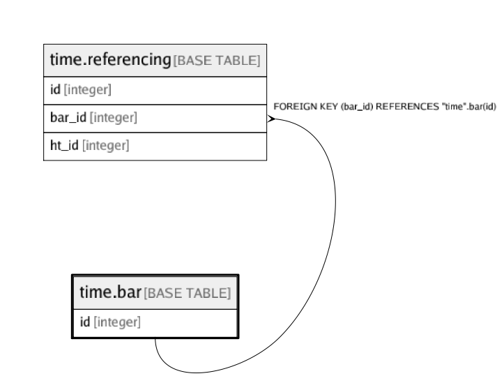

# time.bar

## Description

## Columns

| Name | Type | Default | Nullable | Children | Parents | Comment |
| ---- | ---- | ------- | -------- | -------- | ------- | ------- |
| id | integer |  | false | [time.referencing](time.referencing.md) |  |  |

## Constraints

| Name | Type | Definition |
| ---- | ---- | ---------- |
| bar_pkey | PRIMARY KEY | PRIMARY KEY (id) |

## Indexes

| Name | Definition |
| ---- | ---------- |
| bar_pkey | CREATE UNIQUE INDEX bar_pkey ON "time".bar USING btree (id) |

## Relations

---

> Generated by [tbls](https://github.com/k1LoW/tbls)
