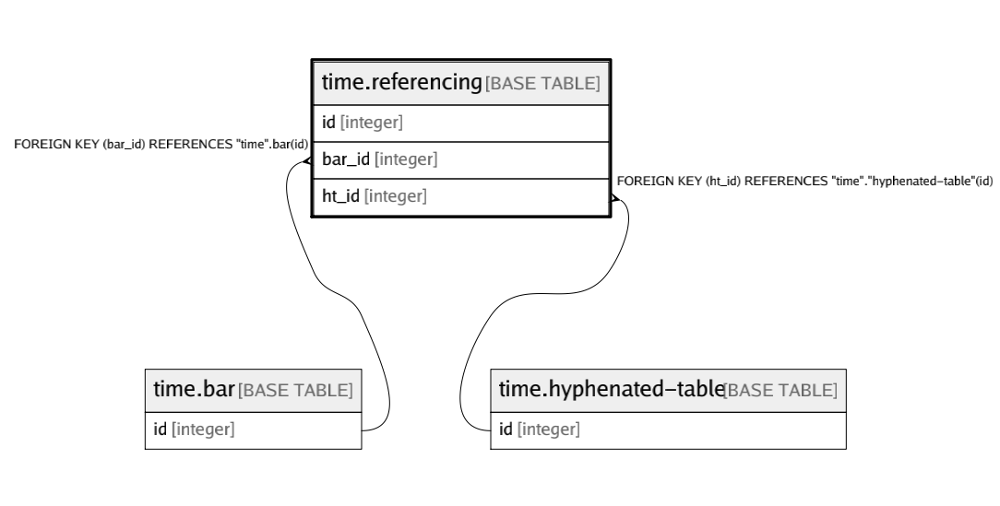

# time.referencing

## Description

## Columns

| Name | Type | Default | Nullable | Children | Parents | Comment |
| ---- | ---- | ------- | -------- | -------- | ------- | ------- |
| id | integer |  | false |  |  |  |
| bar_id | integer |  | false |  | [time.bar](time.bar.md) |  |
| ht_id | integer |  | false |  | [time.hyphenated-table](time.hyphenated-table.md) |  |

## Constraints

| Name | Type | Definition |
| ---- | ---- | ---------- |
| referencing_bar_id | FOREIGN KEY | FOREIGN KEY (bar_id) REFERENCES "time".bar(id) |
| referencing_ht_id | FOREIGN KEY | FOREIGN KEY (ht_id) REFERENCES "time"."hyphenated-table"(id) |
| referencing_pkey | PRIMARY KEY | PRIMARY KEY (id) |

## Indexes

| Name | Definition |
| ---- | ---------- |
| referencing_pkey | CREATE UNIQUE INDEX referencing_pkey ON "time".referencing USING btree (id) |

## Relations

---

> Generated by [tbls](https://github.com/k1LoW/tbls)
