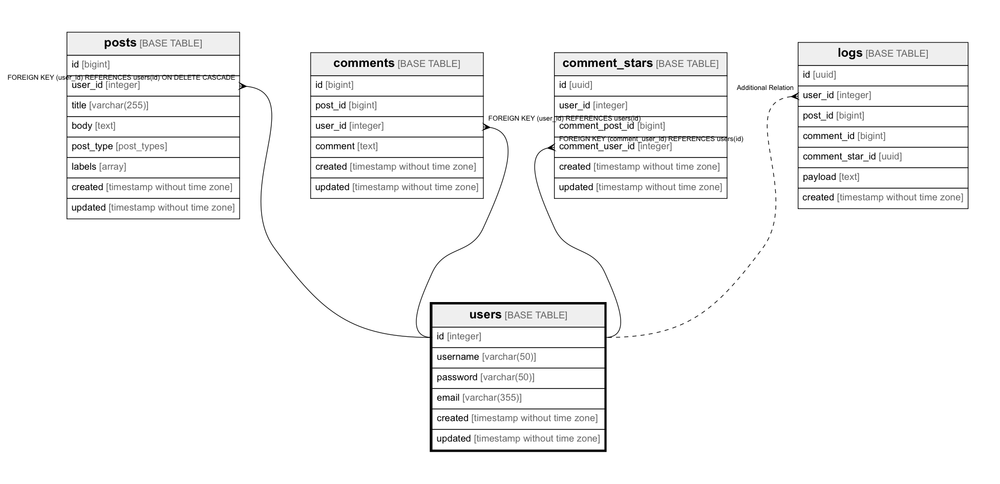

# users

## Description

Users table

## Columns

| Name | Type | Default | Nullable | Children | Parents | Comment |
| ---- | ---- | ------- | -------- | -------- | ------- | ------- |
| id | integer | nextval('users_id_seq'::regclass) | false | [posts](posts.md) [comments](comments.md) [comment_stars](comment_stars.md) [logs](logs.md)  |  |  |
| username | varchar(50) |  | false |  |  |  |
| password | varchar(50) |  | false |  |  |  |
| email | varchar(355) |  | false |  |  | ex. user@example.com |
| created | timestamp without time zone |  | false |  |  |  |
| updated | timestamp without time zone |  | true |  |  |  |

## Constraints

| Name | Type | Definition |
| ---- | ---- | --- |
| users_username_check | CHECK | CHECK ((char_length((username)::text) > 4)) |
| users_pkey | PRIMARY KEY | PRIMARY KEY (id) |
| users_username_key | UNIQUE | UNIQUE (username) |
| users_email_key | UNIQUE | UNIQUE (email) |

## Indexes

| Name | Definition |
| ---- | --- |
| users_pkey | CREATE UNIQUE INDEX users_pkey ON public.users USING btree (id) |
| users_username_key | CREATE UNIQUE INDEX users_username_key ON public.users USING btree (username) |
| users_email_key | CREATE UNIQUE INDEX users_email_key ON public.users USING btree (email) |

## Relations

---

> Generated by [tbls](https://github.com/k1LoW/tbls)