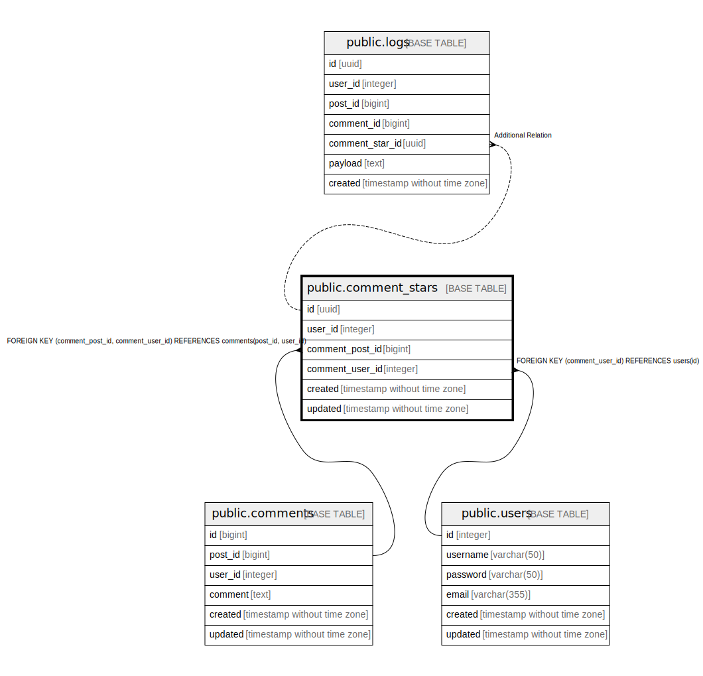

# public.comment_stars

## Description

## Columns

| Name | Type | Default | Nullable | Children | Parents | Comment |
| ---- | ---- | ------- | -------- | -------- | ------- | ------- |
| id | uuid | uuid_generate_v4() | false | [public.logs](public.logs.md) |  |  |
| user_id | integer |  | false |  |  |  |
| comment_post_id | bigint |  | false |  | [public.comments](public.comments.md) |  |
| comment_user_id | integer |  | false |  | [public.users](public.users.md) [public.comments](public.comments.md) |  |
| created | timestamp without time zone |  | false |  |  |  |
| updated | timestamp without time zone |  | true |  |  |  |

## Constraints

| Name | Type | Definition |
| ---- | ---- | ---------- |
| comment_stars_user_id_fk | FOREIGN KEY | FOREIGN KEY (comment_user_id) REFERENCES users(id) |
| comment_stars_user_id_post_id_fk | FOREIGN KEY | FOREIGN KEY (comment_post_id, comment_user_id) REFERENCES comments(post_id, user_id) |
| comment_stars_user_id_comment_post_id_comment_user_id_key | UNIQUE | UNIQUE (user_id, comment_post_id, comment_user_id) |

## Indexes

| Name | Definition |
| ---- | ---------- |
| comment_stars_user_id_comment_post_id_comment_user_id_key | CREATE UNIQUE INDEX comment_stars_user_id_comment_post_id_comment_user_id_key ON public.comment_stars USING btree (user_id, comment_post_id, comment_user_id) |

## Relations

---

> Generated by [tbls](https://github.com/k1LoW/tbls)
