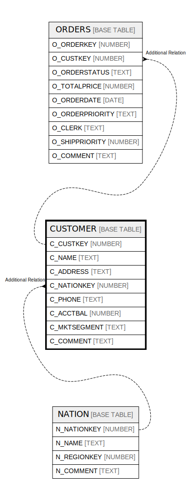

# CUSTOMER

## Description

<details>
<summary><strong>Table Definition</strong></summary>

```sql
create or replace TABLE CUSTOMER (
	C_CUSTKEY NUMBER(38,0) NOT NULL,
	C_NAME VARCHAR(25) NOT NULL,
	C_ADDRESS VARCHAR(40) NOT NULL,
	C_NATIONKEY NUMBER(38,0) NOT NULL,
	C_PHONE VARCHAR(15) NOT NULL,
	C_ACCTBAL NUMBER(12,2) NOT NULL,
	C_MKTSEGMENT VARCHAR(10),
	C_COMMENT VARCHAR(117)
);
```

</details>

## Columns

| Name | Type | Default | Nullable | Children | Parents |
| ---- | ---- | ------- | -------- | -------- | ------- |
| C_CUSTKEY | NUMBER |  | false | [ORDERS](ORDERS.md) |  |
| C_NAME | TEXT |  | false |  |  |
| C_ADDRESS | TEXT |  | false |  |  |
| C_NATIONKEY | NUMBER |  | false |  | [NATION](NATION.md) |
| C_PHONE | TEXT |  | false |  |  |
| C_ACCTBAL | NUMBER |  | false |  |  |
| C_MKTSEGMENT | TEXT |  | true |  |  |
| C_COMMENT | TEXT |  | true |  |  |

## Relations



---

> Generated by [tbls](https://github.com/k1LoW/tbls)
