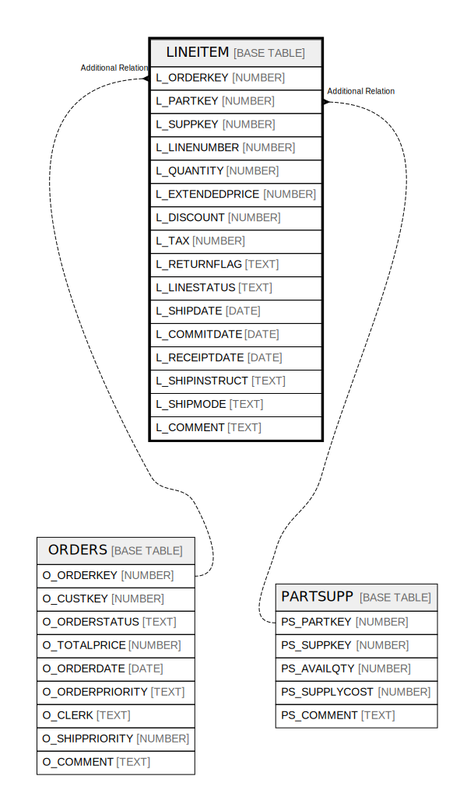

# LINEITEM

## Description

<details>
<summary><strong>Table Definition</strong></summary>

```sql
create or replace TABLE LINEITEM (
	L_ORDERKEY NUMBER(38,0) NOT NULL,
	L_PARTKEY NUMBER(38,0) NOT NULL,
	L_SUPPKEY NUMBER(38,0) NOT NULL,
	L_LINENUMBER NUMBER(38,0) NOT NULL,
	L_QUANTITY NUMBER(12,2) NOT NULL,
	L_EXTENDEDPRICE NUMBER(12,2) NOT NULL,
	L_DISCOUNT NUMBER(12,2) NOT NULL,
	L_TAX NUMBER(12,2) NOT NULL,
	L_RETURNFLAG VARCHAR(1) NOT NULL,
	L_LINESTATUS VARCHAR(1) NOT NULL,
	L_SHIPDATE DATE NOT NULL,
	L_COMMITDATE DATE NOT NULL,
	L_RECEIPTDATE DATE NOT NULL,
	L_SHIPINSTRUCT VARCHAR(25) NOT NULL,
	L_SHIPMODE VARCHAR(10) NOT NULL,
	L_COMMENT VARCHAR(44) NOT NULL
);
```

</details>

## Columns

| Name | Type | Default | Nullable | Parents |
| ---- | ---- | ------- | -------- | ------- |
| L_ORDERKEY | NUMBER |  | false | [ORDERS](ORDERS.md) |
| L_PARTKEY | NUMBER |  | false | [PARTSUPP](PARTSUPP.md) |
| L_SUPPKEY | NUMBER |  | false | [PARTSUPP](PARTSUPP.md) |
| L_LINENUMBER | NUMBER |  | false |  |
| L_QUANTITY | NUMBER |  | false |  |
| L_EXTENDEDPRICE | NUMBER |  | false |  |
| L_DISCOUNT | NUMBER |  | false |  |
| L_TAX | NUMBER |  | false |  |
| L_RETURNFLAG | TEXT |  | false |  |
| L_LINESTATUS | TEXT |  | false |  |
| L_SHIPDATE | DATE |  | false |  |
| L_COMMITDATE | DATE |  | false |  |
| L_RECEIPTDATE | DATE |  | false |  |
| L_SHIPINSTRUCT | TEXT |  | false |  |
| L_SHIPMODE | TEXT |  | false |  |
| L_COMMENT | TEXT |  | false |  |

## Relations



---

> Generated by [tbls](https://github.com/k1LoW/tbls)
