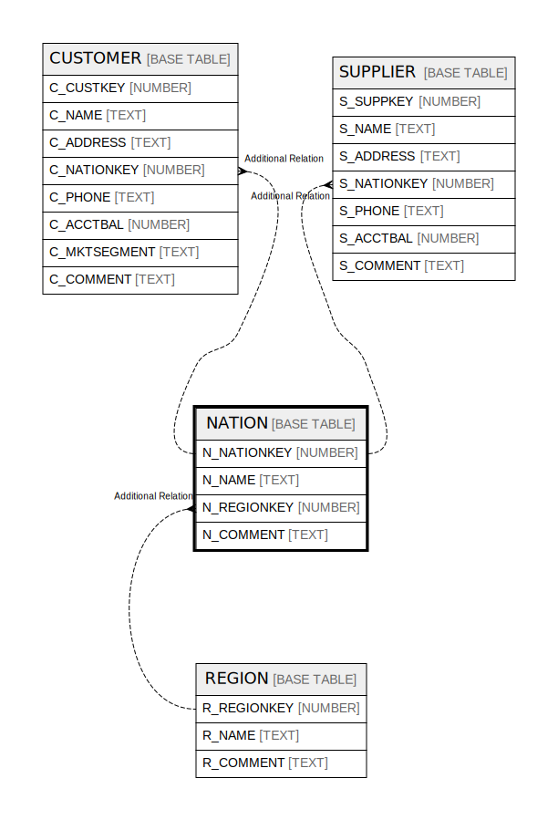

# NATION

## Description

<details>
<summary><strong>Table Definition</strong></summary>

```sql
create or replace TABLE NATION (
	N_NATIONKEY NUMBER(38,0) NOT NULL,
	N_NAME VARCHAR(25) NOT NULL,
	N_REGIONKEY NUMBER(38,0) NOT NULL,
	N_COMMENT VARCHAR(152)
);
```

</details>

## Columns

| Name | Type | Default | Nullable | Children | Parents | Comment |
| ---- | ---- | ------- | -------- | -------- | ------- | ------- |
| N_NATIONKEY | NUMBER |  | false | [CUSTOMER](CUSTOMER.md) [SUPPLIER](SUPPLIER.md) |  |  |
| N_NAME | TEXT |  | false |  |  |  |
| N_REGIONKEY | NUMBER |  | false |  | [REGION](REGION.md) |  |
| N_COMMENT | TEXT |  | true |  |  |  |

## Relations



---

> Generated by [tbls](https://github.com/k1LoW/tbls)
