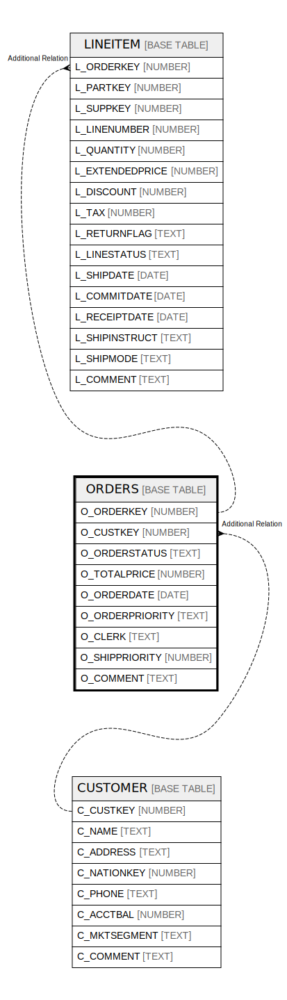

# ORDERS

## Description

<details>
<summary><strong>Table Definition</strong></summary>

```sql
create or replace TABLE ORDERS (
	O_ORDERKEY NUMBER(38,0) NOT NULL,
	O_CUSTKEY NUMBER(38,0) NOT NULL,
	O_ORDERSTATUS VARCHAR(1) NOT NULL,
	O_TOTALPRICE NUMBER(12,2) NOT NULL,
	O_ORDERDATE DATE NOT NULL,
	O_ORDERPRIORITY VARCHAR(15) NOT NULL,
	O_CLERK VARCHAR(15) NOT NULL,
	O_SHIPPRIORITY NUMBER(38,0) NOT NULL,
	O_COMMENT VARCHAR(79) NOT NULL
);
```

</details>

## Columns

| Name | Type | Default | Nullable | Children | Parents |
| ---- | ---- | ------- | -------- | -------- | ------- |
| O_ORDERKEY | NUMBER |  | false | [LINEITEM](LINEITEM.md) |  |
| O_CUSTKEY | NUMBER |  | false |  | [CUSTOMER](CUSTOMER.md) |
| O_ORDERSTATUS | TEXT |  | false |  |  |
| O_TOTALPRICE | NUMBER |  | false |  |  |
| O_ORDERDATE | DATE |  | false |  |  |
| O_ORDERPRIORITY | TEXT |  | false |  |  |
| O_CLERK | TEXT |  | false |  |  |
| O_SHIPPRIORITY | NUMBER |  | false |  |  |
| O_COMMENT | TEXT |  | false |  |  |

## Relations



---

> Generated by [tbls](https://github.com/k1LoW/tbls)
