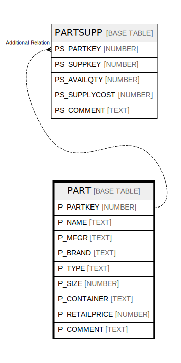

# PART

## Description

<details>
<summary><strong>Table Definition</strong></summary>

```sql
create or replace TABLE PART (
	P_PARTKEY NUMBER(38,0) NOT NULL,
	P_NAME VARCHAR(55) NOT NULL,
	P_MFGR VARCHAR(25) NOT NULL,
	P_BRAND VARCHAR(10) NOT NULL,
	P_TYPE VARCHAR(25) NOT NULL,
	P_SIZE NUMBER(38,0) NOT NULL,
	P_CONTAINER VARCHAR(10) NOT NULL,
	P_RETAILPRICE NUMBER(12,2) NOT NULL,
	P_COMMENT VARCHAR(23)
);
```

</details>

## Columns

| Name | Type | Default | Nullable | Children |
| ---- | ---- | ------- | -------- | -------- |
| P_PARTKEY | NUMBER |  | false | [PARTSUPP](PARTSUPP.md) |
| P_NAME | TEXT |  | false |  |
| P_MFGR | TEXT |  | false |  |
| P_BRAND | TEXT |  | false |  |
| P_TYPE | TEXT |  | false |  |
| P_SIZE | NUMBER |  | false |  |
| P_CONTAINER | TEXT |  | false |  |
| P_RETAILPRICE | NUMBER |  | false |  |
| P_COMMENT | TEXT |  | true |  |

## Relations



---

> Generated by [tbls](https://github.com/k1LoW/tbls)
