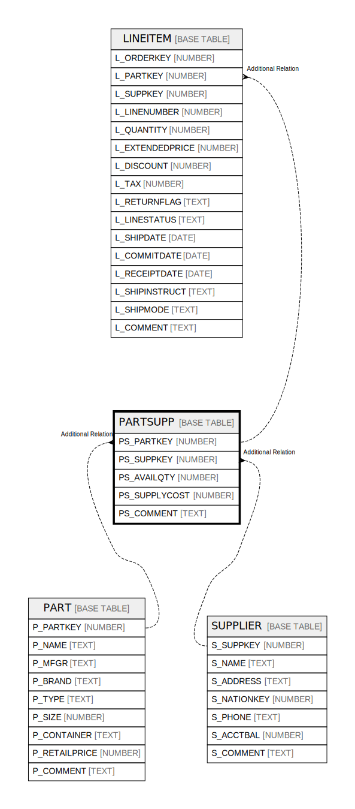

# PARTSUPP

## Description

<details>
<summary><strong>Table Definition</strong></summary>

```sql
create or replace TABLE PARTSUPP (
	PS_PARTKEY NUMBER(38,0) NOT NULL,
	PS_SUPPKEY NUMBER(38,0) NOT NULL,
	PS_AVAILQTY NUMBER(38,0) NOT NULL,
	PS_SUPPLYCOST NUMBER(12,2) NOT NULL,
	PS_COMMENT VARCHAR(199)
);
```

</details>

## Columns

| Name | Type | Default | Nullable | Children | Parents | Comment |
| ---- | ---- | ------- | -------- | -------- | ------- | ------- |
| PS_PARTKEY | NUMBER |  | false | [LINEITEM](LINEITEM.md) | [PART](PART.md) |  |
| PS_SUPPKEY | NUMBER |  | false | [LINEITEM](LINEITEM.md) | [SUPPLIER](SUPPLIER.md) |  |
| PS_AVAILQTY | NUMBER |  | false |  |  |  |
| PS_SUPPLYCOST | NUMBER |  | false |  |  |  |
| PS_COMMENT | TEXT |  | true |  |  |  |

## Relations



---

> Generated by [tbls](https://github.com/k1LoW/tbls)
