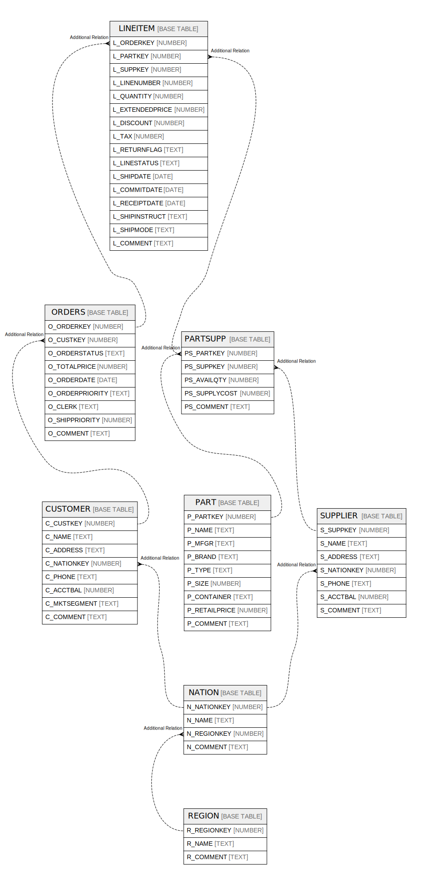

# TPCH_SF1

## Tables

| Name | Columns | Comment | Type |
| ---- | ------- | ------- | ---- |
| [CUSTOMER](CUSTOMER.md) | 8 |  | BASE TABLE |
| [LINEITEM](LINEITEM.md) | 16 |  | BASE TABLE |
| [NATION](NATION.md) | 4 |  | BASE TABLE |
| [ORDERS](ORDERS.md) | 9 |  | BASE TABLE |
| [PART](PART.md) | 9 |  | BASE TABLE |
| [PARTSUPP](PARTSUPP.md) | 5 |  | BASE TABLE |
| [REGION](REGION.md) | 3 |  | BASE TABLE |
| [SUPPLIER](SUPPLIER.md) | 7 |  | BASE TABLE |

## Relations

---

> Generated by [tbls](https://github.com/k1LoW/tbls)
