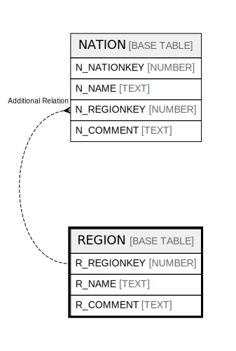

# REGION

## Description

<details>
<summary><strong>Table Definition</strong></summary>

```sql
create or replace TABLE REGION (
	R_REGIONKEY NUMBER(38,0) NOT NULL,
	R_NAME VARCHAR(25) NOT NULL,
	R_COMMENT VARCHAR(152)
);
```

</details>

## Columns

| Name | Type | Default | Nullable | Children |
| ---- | ---- | ------- | -------- | -------- |
| R_REGIONKEY | NUMBER |  | false | [NATION](NATION.md) |
| R_NAME | TEXT |  | false |  |
| R_COMMENT | TEXT |  | true |  |

## Relations



---

> Generated by [tbls](https://github.com/k1LoW/tbls)
