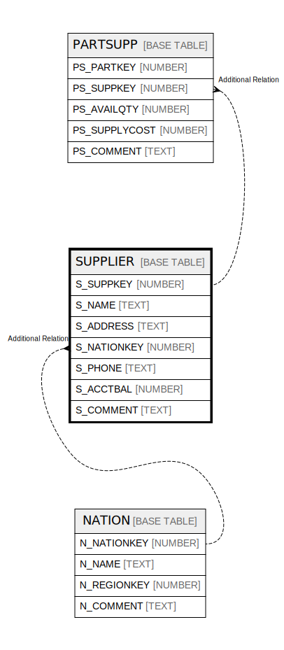

# SUPPLIER

## Description

<details>
<summary><strong>Table Definition</strong></summary>

```sql
create or replace TABLE SUPPLIER (
	S_SUPPKEY NUMBER(38,0) NOT NULL,
	S_NAME VARCHAR(25) NOT NULL,
	S_ADDRESS VARCHAR(40) NOT NULL,
	S_NATIONKEY NUMBER(38,0) NOT NULL,
	S_PHONE VARCHAR(15) NOT NULL,
	S_ACCTBAL NUMBER(12,2) NOT NULL,
	S_COMMENT VARCHAR(101)
);
```

</details>

## Columns

| Name | Type | Default | Nullable | Children | Parents |
| ---- | ---- | ------- | -------- | -------- | ------- |
| S_SUPPKEY | NUMBER |  | false | [PARTSUPP](PARTSUPP.md) |  |
| S_NAME | TEXT |  | false |  |  |
| S_ADDRESS | TEXT |  | false |  |  |
| S_NATIONKEY | NUMBER |  | false |  | [NATION](NATION.md) |
| S_PHONE | TEXT |  | false |  |  |
| S_ACCTBAL | NUMBER |  | false |  |  |
| S_COMMENT | TEXT |  | true |  |  |

## Relations



---

> Generated by [tbls](https://github.com/k1LoW/tbls)
