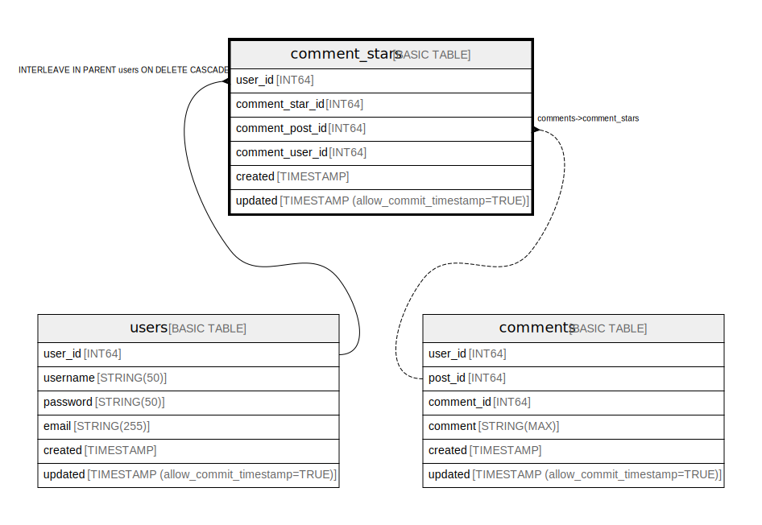

# comment_stars

## Description

Stars of Blog comments

## Columns

| Name | Type | Default | Nullable | Parents |
| ---- | ---- | ------- | -------- | ------- |
| user_id | INT64 |  | false | [users](users.md) |
| comment_star_id | INT64 |  | false | [users](users.md) |
| comment_post_id | INT64 |  | false | [comments](comments.md) |
| comment_user_id | INT64 |  | false | [comments](comments.md) |
| created | TIMESTAMP |  | false |  |
| updated | TIMESTAMP (allow_commit_timestamp=TRUE) |  | true |  |

## Constraints

| Name | Type | Definition |
| ---- | ---- | ---------- |
| PRIMARY_KEY | PRIMARY_KEY | PRIMARY KEY(user_id, comment_star_id) |
| INTERLEAVE | INTERLEAVE | INTERLEAVE IN PARENT users ON DELETE CASCADE |

## Indexes

| Name | Definition |
| ---- | ---------- |
| comment_stars_idx | CREATE UNIQUE INDEX comment_stars_idx ON comment_stars (user_id, comment_post_id, comment_user_id) |

## Relations

---

> Generated by [tbls](https://github.com/k1LoW/tbls)
