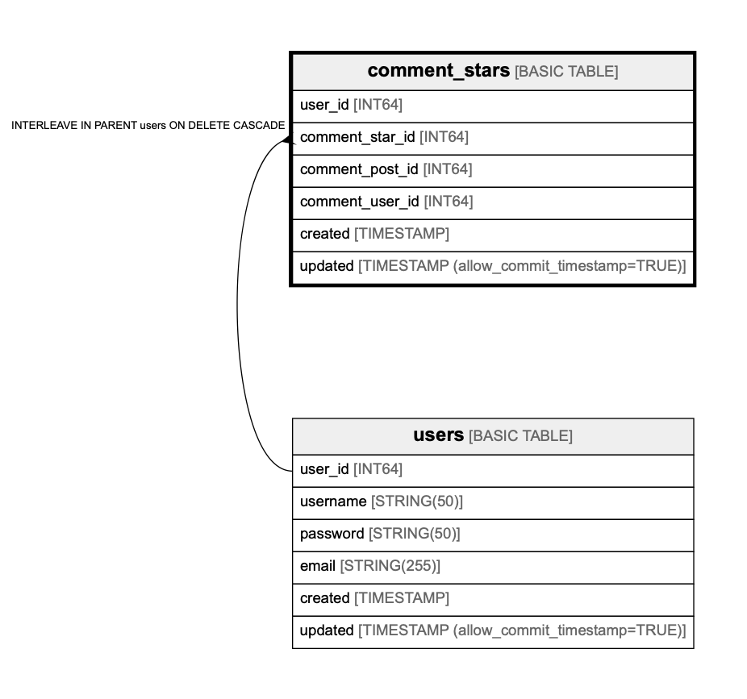

# comment_stars

## Description

## Columns

| Name | Type | Default | Nullable | Children | Parents | Comment |
| ---- | ---- | ------- | -------- | -------- | ------- | ------- |
| user_id | INT64 |  | false |  | [users](users.md) |  |
| comment_star_id | INT64 |  | false |  | [users](users.md) |  |
| comment_post_id | INT64 |  | false |  |  |  |
| comment_user_id | INT64 |  | false |  |  |  |
| created | TIMESTAMP |  | false |  |  |  |
| updated | TIMESTAMP (allow_commit_timestamp=TRUE) |  | true |  |  |  |

## Constraints

| Name | Type | Definition |
| ---- | ---- | ---------- |
| PRIMARY_KEY | PRIMARY_KEY | PRIMARY KEY(comment_star_id, user_id) |
| INTERLEAVE | INTERLEAVE | INTERLEAVE IN PARENT users ON DELETE CASCADE |

## Indexes

| Name | Definition |
| ---- | ---------- |
| comment_stars_idx | CREATE UNIQUE INDEX comment_stars_idx ON comment_stars (comment_post_id, comment_user_id, user_id) |

## Relations

---

> Generated by [tbls](https://github.com/k1LoW/tbls)
