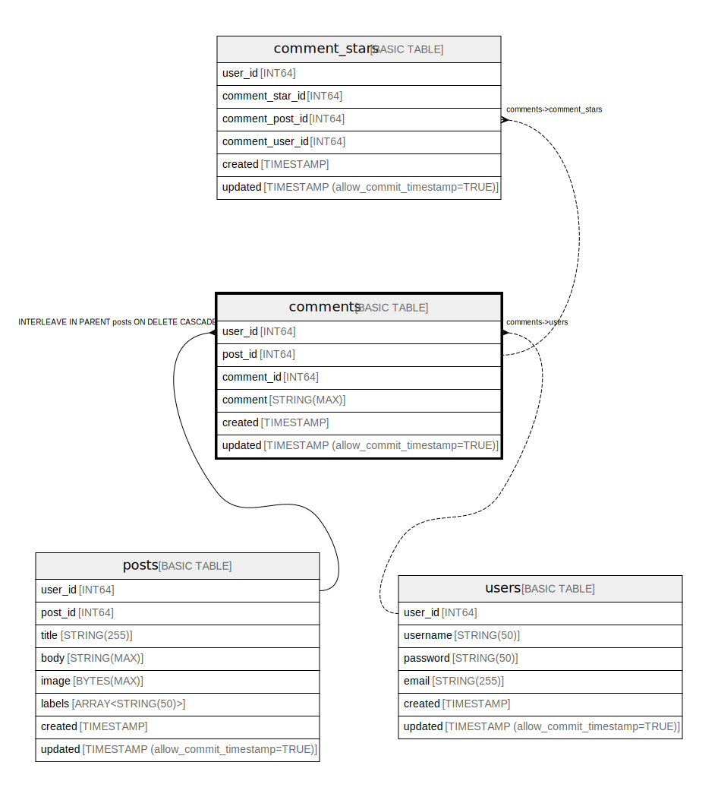

# comments

## Description

Blog comments

## Columns

| Name | Type | Default | Nullable | Children | Parents |
| ---- | ---- | ------- | -------- | -------- | ------- |
| user_id | INT64 |  | false | [comment_stars](comment_stars.md) | [posts](posts.md) [users](users.md) |
| post_id | INT64 |  | false | [comment_stars](comment_stars.md) | [posts](posts.md) |
| comment_id | INT64 |  | false |  | [posts](posts.md) |
| comment | STRING(MAX) |  | false |  |  |
| created | TIMESTAMP |  | false |  |  |
| updated | TIMESTAMP (allow_commit_timestamp=TRUE) |  | true |  |  |

## Constraints

| Name | Type | Definition |
| ---- | ---- | ---------- |
| PRIMARY_KEY | PRIMARY_KEY | PRIMARY KEY(user_id, post_id, comment_id) |
| INTERLEAVE | INTERLEAVE | INTERLEAVE IN PARENT posts ON DELETE CASCADE |

## Indexes

| Name | Definition |
| ---- | ---------- |
| comments_post_id_user_id_idx | CREATE UNIQUE INDEX comments_post_id_user_id_idx ON comments (post_id, user_id) |
| comments_post_id_idx | CREATE INDEX comments_post_id_idx ON comments (user_id, post_id, comment_id, comment), INTERLEAVE IN posts |

## Relations

---

> Generated by [tbls](https://github.com/k1LoW/tbls)
