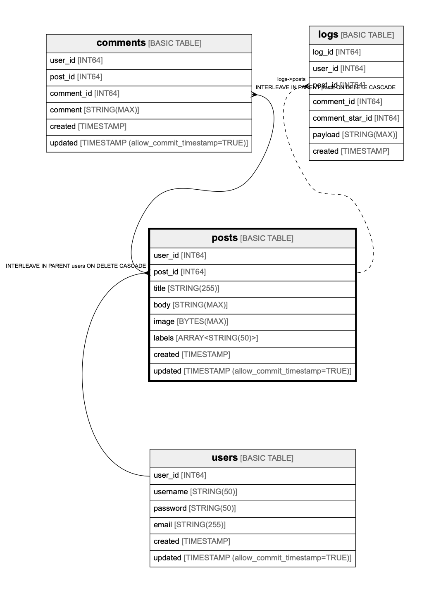

# posts

## Description

## Columns

| Name | Type | Default | Nullable | Children | Parents | Comment |
| ---- | ---- | ------- | -------- | -------- | ------- | ------- |
| user_id | INT64 |  | false | [comments](comments.md) | [users](users.md) |  |
| post_id | INT64 |  | false | [comments](comments.md) [logs](logs.md) | [users](users.md) |  |
| title | STRING(255) |  | false |  |  |  |
| body | STRING(MAX) |  | false |  |  |  |
| image | BYTES(MAX) |  | false |  |  |  |
| labels | ARRAY<STRING(50)> |  | true |  |  |  |
| created | TIMESTAMP |  | false |  |  |  |
| updated | TIMESTAMP (allow_commit_timestamp=TRUE) |  | true |  |  |  |

## Constraints

| Name | Type | Definition |
| ---- | ---- | ---------- |
| PRIMARY_KEY | PRIMARY_KEY | PRIMARY KEY(post_id, user_id) |
| INTERLEAVE | INTERLEAVE | INTERLEAVE IN PARENT users ON DELETE CASCADE |

## Indexes

| Name | Definition |
| ---- | ---------- |
| posts_user_id_title_idx | CREATE UNIQUE NULL_FILTERED INDEX posts_user_id_title_idx ON posts (title, user_id) |
| posts_user_id_idx | CREATE INDEX posts_user_id_idx ON posts (user_id) STORING (title) |

## Relations

---

> Generated by [tbls](https://github.com/k1LoW/tbls)
