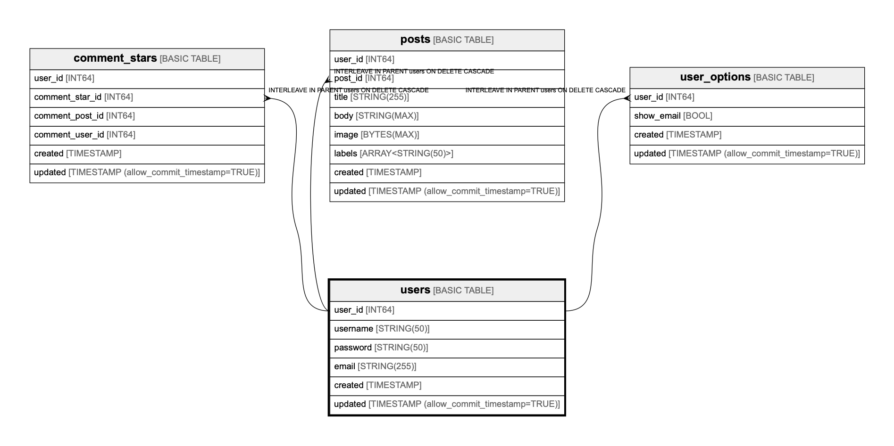

# users

## Description

Users

## Columns

| Name | Type | Default | Nullable | Children | Parents | Comment |
| ---- | ---- | ------- | -------- | -------- | ------- | ------- |
| user_id | INT64 |  | false | [comment_stars](comment_stars.md) [posts](posts.md) [user_options](user_options.md) [comments](comments.md) [logs](logs.md) |  |  |
| username | STRING(50) |  | false |  |  |  |
| password | STRING(50) |  | false |  |  |  |
| email | STRING(255) |  | false |  |  | Email address as login id. ex. user@example.com |
| created | TIMESTAMP |  | false |  |  |  |
| updated | TIMESTAMP (allow_commit_timestamp=TRUE) |  | true |  |  |  |

## Constraints

| Name | Type | Definition |
| ---- | ---- | ---------- |
| PRIMARY_KEY | PRIMARY_KEY | PRIMARY KEY(user_id) |

## Indexes

| Name | Definition |
| ---- | ---------- |
| users_username_idx | CREATE UNIQUE INDEX users_username_idx ON users (username) |
| users_email_idx | CREATE UNIQUE INDEX users_email_idx ON users (email) |

## Relations

---

> Generated by [tbls](https://github.com/k1LoW/tbls)
