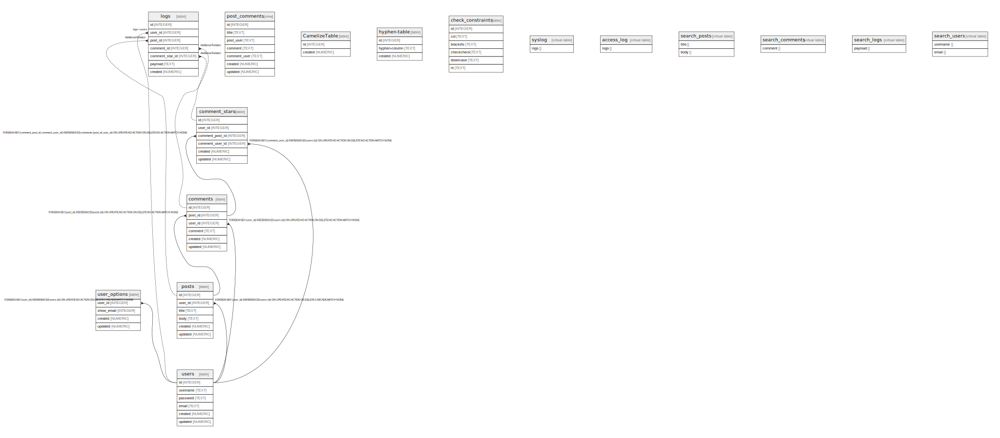

# testdb.sqlite3

## Description

Sample database document.

## Labels

`sample` `tbls`

## Tables

| Name | Columns | Comment | Type | Labels |
| ---- | ------- | ------- | ---- | ------ |
| [users](users.md) | 6 |  | table |  |
| [user_options](user_options.md) | 4 |  | table |  |
| [posts](posts.md) | 6 |  | table | `green` `red` `blue` |
| [comments](comments.md) | 6 |  | table |  |
| [comment_stars](comment_stars.md) | 6 |  | table |  |
| [logs](logs.md) | 7 |  | table |  |
| [post_comments](post_comments.md) | 7 | post and comments View table | view |  |
| [CamelizeTable](CamelizeTable.md) | 2 |  | table |  |
| [hyphen-table](hyphen-table.md) | 3 |  | table |  |
| [check_constraints](check_constraints.md) | 6 |  | table |  |
| [syslog](syslog.md) | 1 |  | virtual table |  |
| [access_log](access_log.md) | 1 |  | virtual table |  |
| [search_posts](search_posts.md) | 2 |  | virtual table |  |
| [search_comments](search_comments.md) | 1 |  | virtual table |  |
| [search_logs](search_logs.md) | 1 |  | virtual table |  |
| [search_users](search_users.md) | 2 |  | virtual table |  |

## Relations

---

> Generated by [tbls](https://github.com/k1LoW/tbls)
