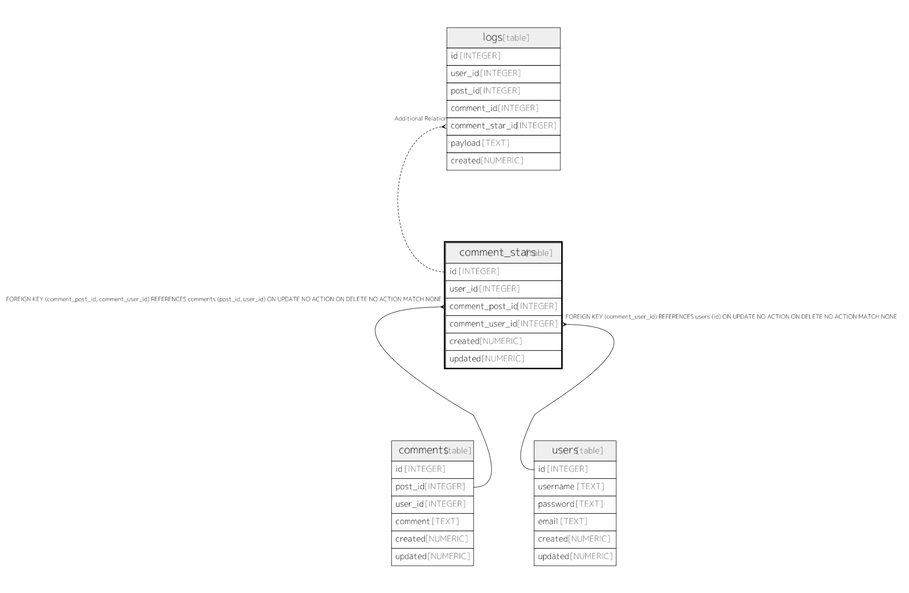

# comment_stars

## Description


<details>
<summary><strong>Table Definition</strong></summary>

```sql
CREATE TABLE comment_stars (
  id INTEGER PRIMARY KEY AUTOINCREMENT,
  user_id INTEGER NOT NULL,
  comment_post_id INTEGER NOT NULL,
  comment_user_id INTEGER NOT NULL,
  created NUMERIC NOT NULL,
  updated NUMERIC,
  CONSTRAINT comment_stars_user_id_post_id_fk FOREIGN KEY(comment_post_id, comment_user_id) REFERENCES comments(post_id, user_id),
  CONSTRAINT comment_stars_user_id_fk FOREIGN KEY(comment_user_id) REFERENCES users(id),
  UNIQUE(user_id, comment_post_id, comment_user_id)
)
```

</details>


## Columns

| Name | Type | Default | Nullable | Children | Parents | Comment |
| ---- | ---- | ------- | -------- | -------- | ------- | ------- |
| id | INTEGER |  | true | [logs](logs.md) |  |  |
| user_id | INTEGER |  | false |  |  |  |
| comment_post_id | INTEGER |  | false |  |  |  |
| comment_user_id | INTEGER |  | false |  |  |  |
| created | NUMERIC |  | false |  |  |  |
| updated | NUMERIC |  | true |  |  |  |

## Constraints

| Name | Type | Definition |
| ---- | ---- | ---------- |
| - (Foreign key ID: 0) | FOREIGN KEY | FOREIGN KEY (comment_user_id) REFERENCES users (id) ON UPDATE NO ACTION ON DELETE NO ACTION MATCH NONE |
| - (Foreign key ID: 1) | FOREIGN KEY | FOREIGN KEY (comment_post_id, comment_user_id) REFERENCES comments (post_id, user_id) ON UPDATE NO ACTION ON DELETE NO ACTION MATCH NONE |
| sqlite_autoindex_comment_stars_1 | UNIQUE | UNIQUE (user_id, comment_post_id, comment_user_id) |

## Indexes

| Name | Definition |
| ---- | ---------- |
| sqlite_autoindex_comment_stars_1 | UNIQUE (user_id, comment_post_id, comment_user_id) |


## Relations



---

> Generated by [tbls](https://github.com/k1LoW/tbls)