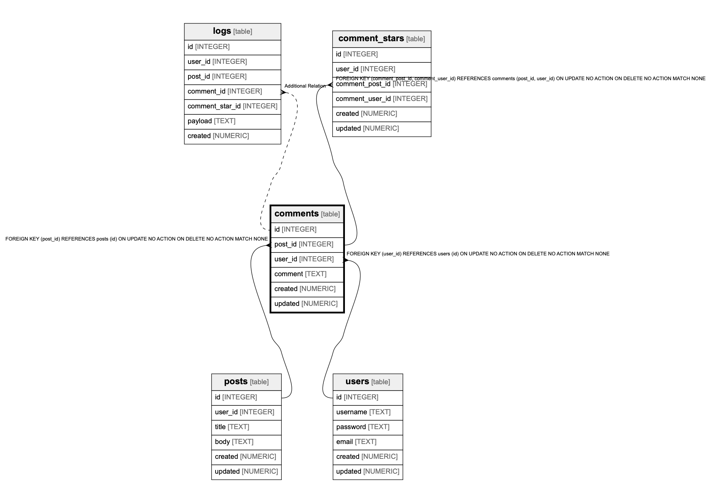

# comments

## Description


<details>
<summary><strong>Table Definition</strong></summary>

```sql
CREATE TABLE comments (
  id INTEGER PRIMARY KEY AUTOINCREMENT,
  post_id INTEGER NOT NULL,
  user_id INTEGER NOT NULL,
  comment TEXT NOT NULL,
  created NUMERIC NOT NULL,
  updated NUMERIC,
  FOREIGN KEY(post_id) REFERENCES posts(id),
  FOREIGN KEY(user_id) REFERENCES users(id),
  UNIQUE(post_id, user_id)
)
```

</details>


## Columns

| Name | Type | Default | Nullable | Children | Parents | Comment |
| ---- | ---- | ------- | -------- | -------- | ------- | ------- |
| id | INTEGER |  | true | [logs](logs.md) |  |  |
| post_id | INTEGER |  | false |  |  |  |
| user_id | INTEGER |  | false |  |  |  |
| comment | TEXT |  | false |  |  |  |
| created | NUMERIC |  | false |  |  |  |
| updated | NUMERIC |  | true |  |  |  |


## Indexes

| Name | Definition |
| ---- | ---------- |
| sqlite_autoindex_comments_1 |  |
| comments_post_id_user_id_idx | CREATE INDEX comments_post_id_user_id_idx ON comments(post_id, user_id) |


## Relations



---

> Generated by [tbls](https://github.com/k1LoW/tbls)