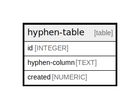

# hyphen-table

## Description

<details>
<summary><strong>Table Definition</strong></summary>

```sql
CREATE TABLE 'hyphen-table' (
  id INTEGER PRIMARY KEY AUTOINCREMENT,
  'hyphen-column' TEXT NOT NULL,
  created NUMERIC NOT NULL
)
```

</details>

## Columns

| Name | Type | Default | Nullable | Children | Parents | Comment |
| ---- | ---- | ------- | -------- | -------- | ------- | ------- |
| id | INTEGER |  | true |  |  |  |
| hyphen-column | TEXT |  | false |  |  |  |
| created | NUMERIC |  | false |  |  |  |

## Constraints

| Name | Type | Definition |
| ---- | ---- | ---------- |
| id | PRIMARY KEY | PRIMARY KEY (id) |

## Relations



---

> Generated by [tbls](https://github.com/k1LoW/tbls)
