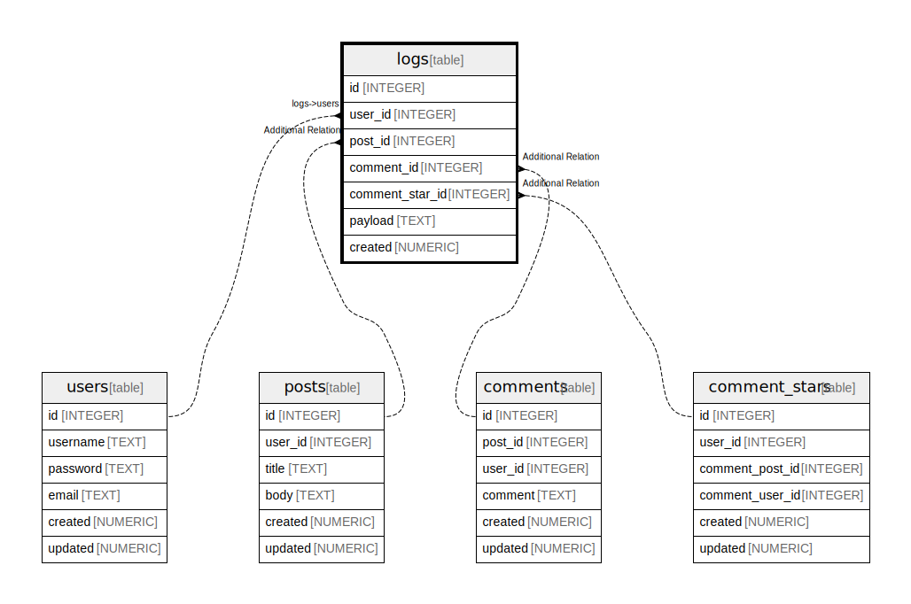

# logs

## Description

<details>
<summary><strong>Table Definition</strong></summary>

```sql
CREATE TABLE logs (
  id INTEGER PRIMARY KEY AUTOINCREMENT,
  user_id INTEGER NOT NULL,
  post_id INTEGER,
  comment_id INTEGER,
  comment_star_id INTEGER,
  payload TEXT,
  created NUMERIC NOT NULL
)
```

</details>

## Columns

| Name | Type | Default | Nullable | Parents |
| ---- | ---- | ------- | -------- | ------- |
| id | INTEGER |  | true |  |
| user_id | INTEGER |  | false | [users](users.md) |
| post_id | INTEGER |  | true | [posts](posts.md) |
| comment_id | INTEGER |  | true | [comments](comments.md) |
| comment_star_id | INTEGER |  | true | [comment_stars](comment_stars.md) |
| payload | TEXT |  | true |  |
| created | NUMERIC |  | false |  |

## Constraints

| Name | Type | Definition |
| ---- | ---- | ---------- |
| id | PRIMARY KEY | PRIMARY KEY (id) |

## Relations



---

> Generated by [tbls](https://github.com/k1LoW/tbls)
