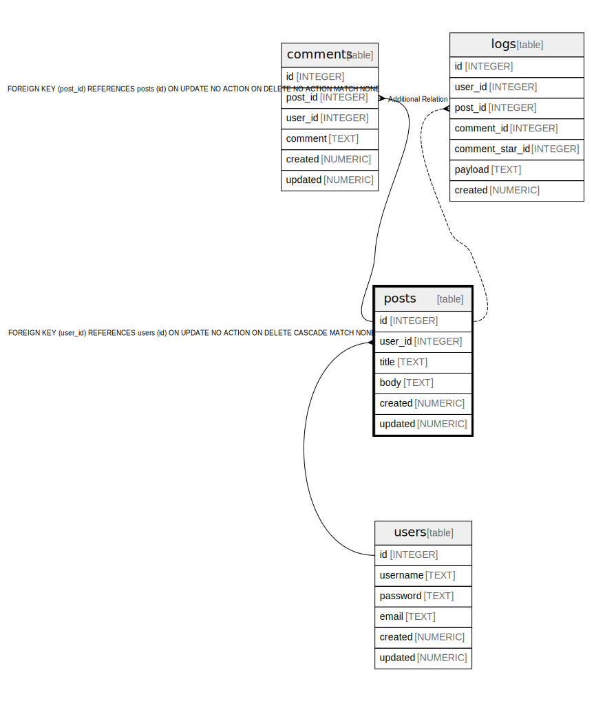

# posts

## Description

<details>
<summary><strong>Table Definition</strong></summary>

```sql
CREATE TABLE posts (
  id INTEGER PRIMARY KEY AUTOINCREMENT,
  user_id INTEGER NOT NULL,
  title TEXT NOT NULL,
  body TEXT NOT NULL,
  created NUMERIC NOT NULL,
  updated NUMERIC,
  CONSTRAINT posts_user_id_fk FOREIGN KEY(user_id) REFERENCES users(id) MATCH NONE ON UPDATE NO ACTION ON DELETE CASCADE
)
```

</details>

## Labels

`green` `red` `blue`

## Columns

| Name | Type | Default | Nullable | Children | Parents | Comment |
| ---- | ---- | ------- | -------- | -------- | ------- | ------- |
| id | INTEGER |  | true | [comments](comments.md) [logs](logs.md) |  |  |
| user_id | INTEGER |  | false |  | [users](users.md) |  |
| title | TEXT |  | false |  |  |  |
| body | TEXT |  | false |  |  | post body |
| created | NUMERIC |  | false |  |  |  |
| updated | NUMERIC |  | true |  |  |  |

## Constraints

| Name | Type | Definition |
| ---- | ---- | ---------- |
| id | PRIMARY KEY | PRIMARY KEY (id) |
| - (Foreign key ID: 0) | FOREIGN KEY | FOREIGN KEY (user_id) REFERENCES users (id) ON UPDATE NO ACTION ON DELETE CASCADE MATCH NONE |

## Indexes

| Name | Definition |
| ---- | ---------- |
| posts_user_id_idx | CREATE INDEX posts_user_id_idx ON posts(user_id) |

## Triggers

| Name | Definition |
| ---- | ---------- |
| update_posts_updated | CREATE TRIGGER update_posts_updated AFTER UPDATE ON posts FOR EACH ROW<br />BEGIN<br />  UPDATE posts SET updated = current_timestamp WHERE id = OLD.id;<br />END |
| posts_fts_insert | CREATE TRIGGER posts_fts_insert AFTER INSERT ON posts BEGIN<br />  INSERT INTO search_posts(rowid, title, body) VALUES (new.id, new.title, new.body);<br />END |
| posts_fts_delete | CREATE TRIGGER posts_fts_delete AFTER DELETE ON posts BEGIN<br />  INSERT INTO search_posts(search_posts, rowid, title, body) VALUES('delete', old.id, old.title, old.body);<br />END |
| posts_fts_update | CREATE TRIGGER posts_fts_update AFTER UPDATE ON posts BEGIN<br />  INSERT INTO search_posts(search_posts, rowid, title, body) VALUES('delete', old.id, old.title, old.body);<br />  INSERT INTO search_posts(rowid, title, body) VALUES (new.id, new.title, new.body);<br />END |

## Relations



---

> Generated by [tbls](https://github.com/k1LoW/tbls)
