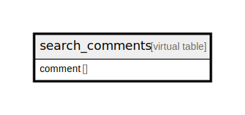

# search_comments

## Description

<details>
<summary><strong>Table Definition</strong></summary>

```sql
CREATE VIRTUAL TABLE search_comments USING fts5(
  comment,
  tokenize='porter unicode61'
)
```

</details>

## Columns

| Name | Type | Default | Nullable | Children | Parents | Comment |
| ---- | ---- | ------- | -------- | -------- | ------- | ------- |
| comment |  |  | true |  |  |  |

## Relations



---

> Generated by [tbls](https://github.com/k1LoW/tbls)
