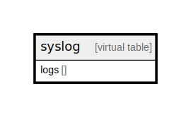

# syslog

## Description

<details>
<summary><strong>Table Definition</strong></summary>

```sql
CREATE VIRTUAL TABLE syslog USING fts3(logs)
```

</details>

## Columns

| Name | Type | Default | Nullable |
| ---- | ---- | ------- | -------- |
| logs |  |  | true |

## Relations



---

> Generated by [tbls](https://github.com/k1LoW/tbls)
