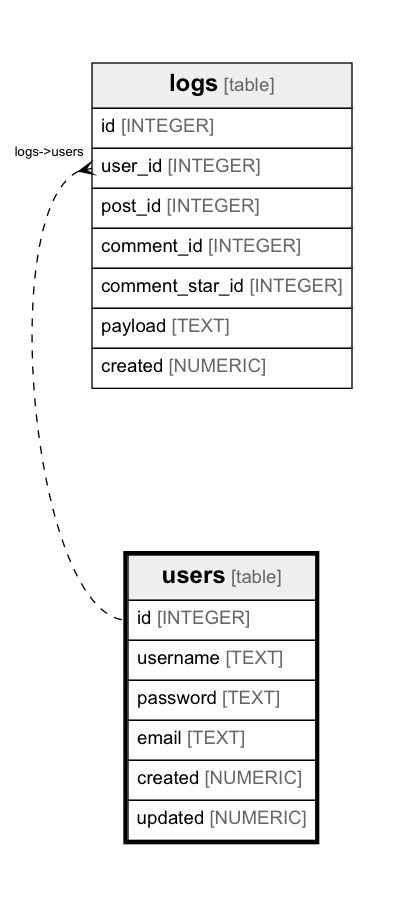

# users

## Description


<details>
<summary><strong>Table Definition</strong></summary>

```sql
CREATE TABLE users (
  id INTEGER PRIMARY KEY AUTOINCREMENT,
  username TEXT UNIQUE NOT NULL CHECK(length(username) > 4),
  password TEXT NOT NULL,
  email TEXT UNIQUE NOT NULL,
  created NUMERIC NOT NULL,
  updated NUMERIC
)
```

</details>


## Columns

| Name | Type | Default | Nullable | Children | Parents | Comment |
| ---- | ---- | ------- | -------- | -------- | ------- | ------- |
| id | INTEGER |  | true | [logs](logs.md) |  |  |
| username | TEXT |  | false |  |  |  |
| password | TEXT |  | false |  |  |  |
| email | TEXT |  | false |  |  |  |
| created | NUMERIC |  | false |  |  |  |
| updated | NUMERIC |  | true |  |  |  |


## Indexes

| Name | Definition |
| ---- | ---------- |
| sqlite_autoindex_users_1 |  |
| sqlite_autoindex_users_2 |  |


## Relations



---

> Generated by [tbls](https://github.com/k1LoW/tbls)