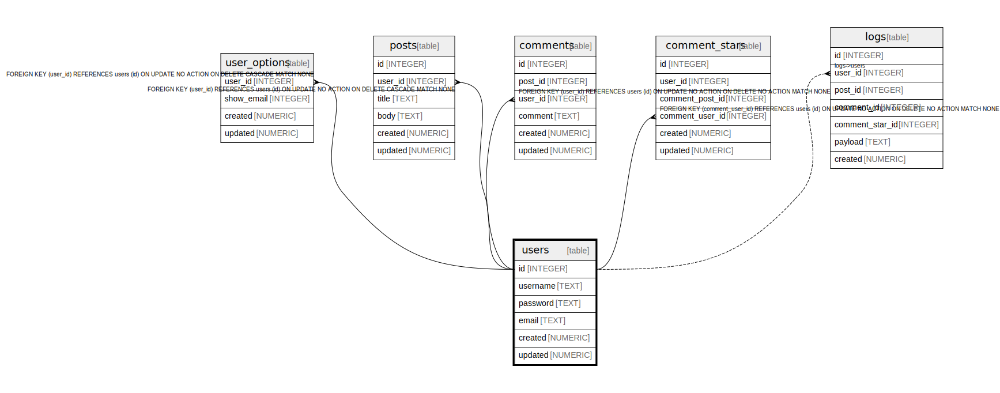

# users

## Description

<details>
<summary><strong>Table Definition</strong></summary>

```sql
CREATE TABLE users (
  id INTEGER PRIMARY KEY AUTOINCREMENT,
  username TEXT UNIQUE NOT NULL CHECK(length(username) > 4),
  password TEXT NOT NULL,
  email TEXT UNIQUE NOT NULL,
  created NUMERIC NOT NULL,
  updated NUMERIC
)
```

</details>

## Columns

| Name | Type | Default | Nullable | Children | Parents | Comment | Labels |
| ---- | ---- | ------- | -------- | -------- | ------- | ------- | ------ |
| id | INTEGER |  | true | [user_options](user_options.md) [posts](posts.md) [comments](comments.md) [comment_stars](comment_stars.md) [logs](logs.md) |  |  |  |
| username | TEXT |  | false |  |  |  |  |
| password | TEXT |  | false |  |  |  | `secure` `encrypted` |
| email | TEXT |  | false |  |  |  | `secure` |
| created | NUMERIC |  | false |  |  |  |  |
| updated | NUMERIC |  | true |  |  |  |  |

## Constraints

| Name | Type | Definition |
| ---- | ---- | ---------- |
| id | PRIMARY KEY | PRIMARY KEY (id) |
| sqlite_autoindex_users_2 | UNIQUE | UNIQUE (email) |
| sqlite_autoindex_users_1 | UNIQUE | UNIQUE (username) |
| - | CHECK | CHECK(length(username) > 4) |

## Indexes

| Name | Definition |
| ---- | ---------- |
| users_username_key | CREATE UNIQUE INDEX users_username_key ON users(username) |
| sqlite_autoindex_users_2 | UNIQUE (email) |
| sqlite_autoindex_users_1 | UNIQUE (username) |

## Relations



---

> Generated by [tbls](https://github.com/k1LoW/tbls)
