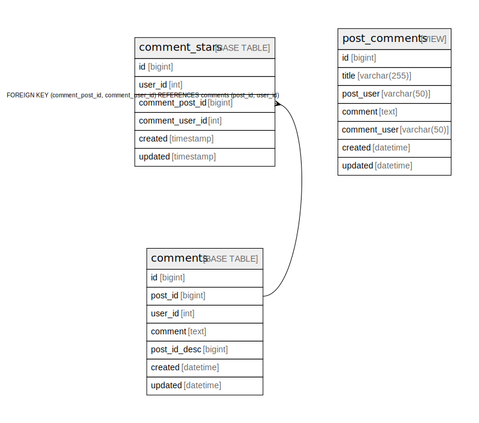
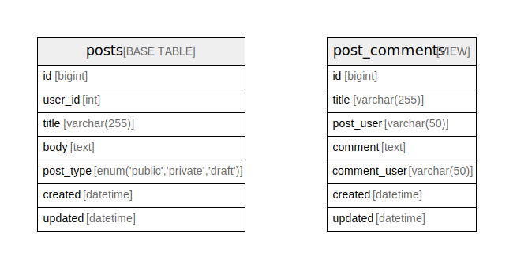
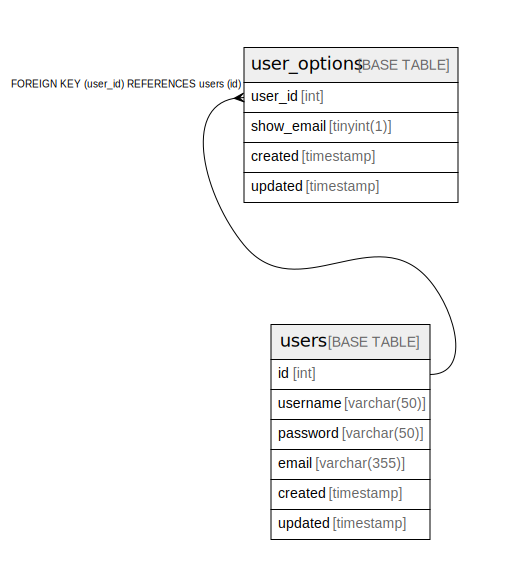
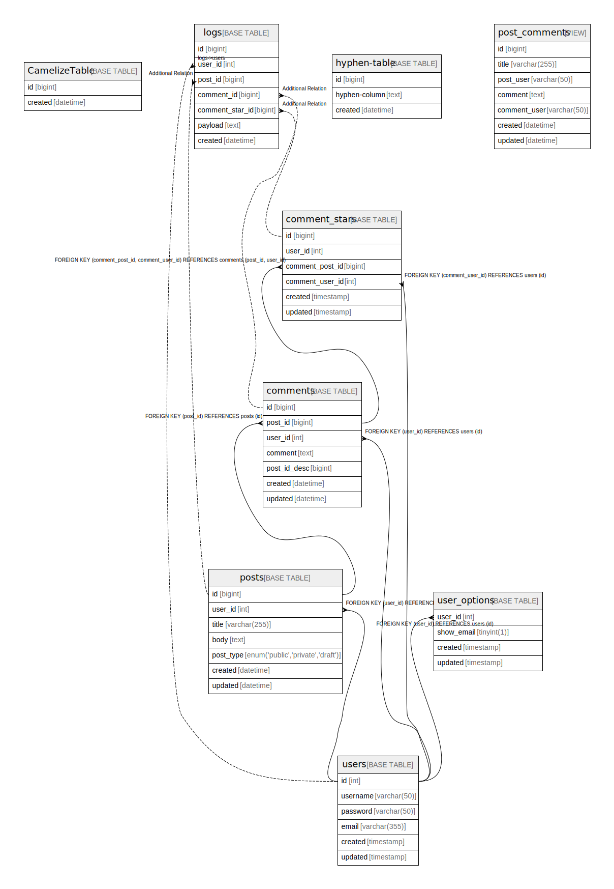

# testdb

## Description

Sample database document.

## Labels

`sample` `tbls`

## Tables

comment

### Group Tables

| Name | Columns | Comment | Type |
| ---- | ------- | ------- | ---- |
| [comment_stars](comment_stars.md) | 6 |  | BASE TABLE |
| [comments](comments.md) | 7 | Comments Multi-line table comment | BASE TABLE |
| [post_comments](post_comments.md) | 7 | post and comments View table | VIEW |

### Group Relations

post

### Group Tables

| Name | Columns | Comment | Type | Labels |
| ---- | ------- | ------- | ---- | ------ |
| [post_comments](post_comments.md) | 7 | post and comments View table | VIEW |  |
| [posts](posts.md) | 7 | Posts table | BASE TABLE | `green` `red` `blue` |

### Group Relations

user

### Group Tables

| Name | Columns | Comment | Type |
| ---- | ------- | ------- | ---- |
| [user_options](user_options.md) | 4 | User options table | BASE TABLE |
| [users](users.md) | 6 | Users table | BASE TABLE |

### Group Relations

### Other

| Name | Columns | Comment | Type |
| ---- | ------- | ------- | ---- |
| [CamelizeTable](CamelizeTable.md) | 2 |  | BASE TABLE |
| [hyphen-table](hyphen-table.md) | 3 |  | BASE TABLE |
| [logs](logs.md) | 7 | Auditログ | BASE TABLE |

## Stored procedures and functions

| Name | ReturnType | Arguments | Type |
| ---- | ------- | ------- | ---- |
| CustomerLevel | varchar | credit decimal | FUNCTION |
| GetAllComments |  |  | PROCEDURE |

## Relations

---

> Generated by [tbls](https://github.com/k1LoW/tbls)
