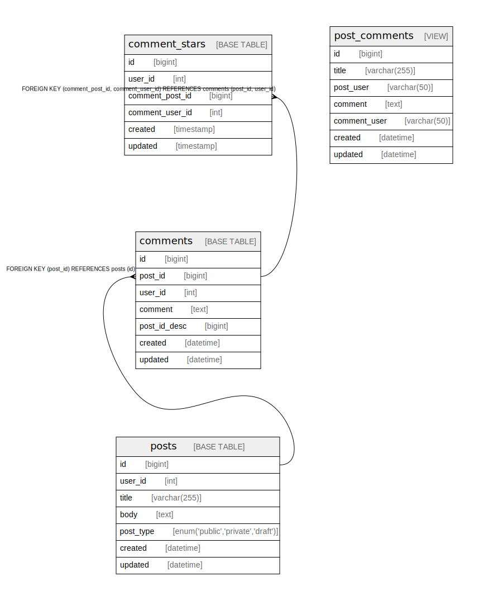

# Content

## Description

Content as an asset for blogging services

## Tables

| Name | Columns | Comment | Type | Labels |
| ---- | ------- | ------- | ---- | ------ |
| [comment_stars](comment_stars.md) | 6 |  | BASE TABLE | `content` |
| [comments](comments.md) | 7 | Comments Multi-line table comment | BASE TABLE | `content` |
| [post_comments](post_comments.md) | 7 | post and comments View table | VIEW | `content` |
| [posts](posts.md) | 7 | Posts table | BASE TABLE | `content` |---

> Generated by [tbls](https://github.com/k1LoW/tbls)
