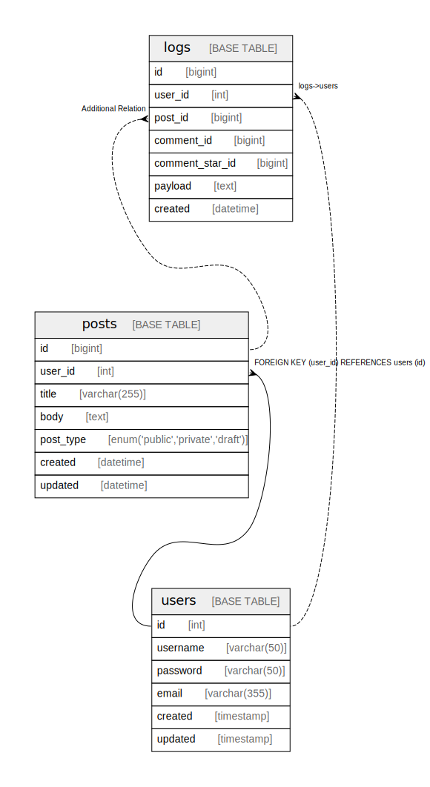

# Ops

## Description

Tables to be referenced during operation

## Tables

| Name | Columns | Comment | Type | Labels |
| ---- | ------- | ------- | ---- | ------ |
| [logs](logs.md) | 7 | Auditログ | BASE TABLE |  |
| [posts](posts.md) | 7 | Posts table | BASE TABLE | `content` |
| [users](users.md) | 6 | Users table | BASE TABLE | `user` |

## Relations

---

> Generated by [tbls](https://github.com/k1LoW/tbls)
